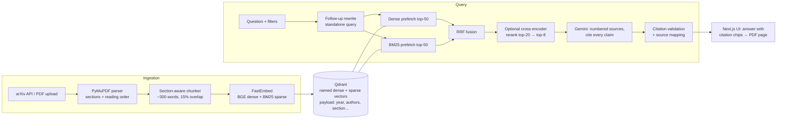

# ResearchRAG

ResearchRAG is a full-stack retrieval-augmented generation (RAG) platform for research papers. It covers semantic search and question answering across a paper library. Answers cite the exact paper section and page they come from. A built-in evaluation harness measures retrieval quality, answer quality and citation accuracy.

- **Ingestion:** arXiv import (by ID or topic search) or PDF upload. PDFs are parsed into sections using typography cues and two-column reading order, then chunked with section-aware boundaries.
- **Hybrid retrieval:**
  - dense BGE embeddings and sparse BM25, fused with reciprocal rank fusion (RRF) in Qdrant;
  - then an optional cross-encoder reranker (off by default, since it costs ~4 s per query and only helped keyword-style questions in the evaluation);
  - with metadata filters on year, author, arXiv category, paper and section type.
- **Conversational follow-ups:** a follow-up such as "what are its limitations?" is rewritten into a standalone question before retrieval, and the UI shows what was searched.
- **Citation-aware generation:** Gemini answers only from numbered sources and cites every claim. Citation markers are checked against the retrieved sources and mapped back to the paper, section and page. The UI opens the PDF at the cited page.
- **Automated evaluation:**
  - synthetic question sets with gold passages, plus hand-written multi-paper and unanswerable questions;
  - IR metrics (Hit@k, Recall@k, MRR, nDCG) compared across four retrieval configs;
  - LLM-as-judge scoring of faithfulness, answer relevance and correctness;
  - per-claim citation precision and coverage, refusal accuracy on unanswerable questions, and false refusals.

## Architecture



| Layer | Tech |
|---|---|
| API | FastAPI, Pydantic v2, SQLModel/SQLite (paper metadata and eval runs), SSE streaming |
| Retrieval | Qdrant (server or embedded), FastEmbed: `BAAI/bge-small-en-v1.5` (dense), `Qdrant/bm25` (sparse, IDF), `Xenova/ms-marco-MiniLM-L-6-v2` (cross-encoder). All ONNX, CPU-only, no torch. |
| Generation | Google Gemini (`google-genai`) with a model fallback chain, rolling-window rate limiting and retry for the free tier |
| Frontend | Next.js 16 (App Router), React 19, Tailwind CSS 4, Recharts, react-markdown + KaTeX |

## Quick start

Prerequisites: Python ≥ 3.12 with [uv](https://docs.astral.sh/uv/), Node ≥ 20, and a free [Gemini API key](https://aistudio.google.com/apikey). Docker is optional.

```bash
# 1. Backend
cd backend
uv sync
cp .env.example .env          # then set GEMINI_API_KEY
uv run uvicorn app.main:app --port 8000

# 2. Frontend (new terminal)
cd frontend
npm install
cp .env.example .env.local    # NEXT_PUBLIC_API_URL=http://localhost:8000
npm run dev                   # http://localhost:3000
```

In the UI, go to **Library** and paste some arXiv IDs, for example `1706.03762 2005.11401 1810.04805 2004.04906`. Wait for them to show **Indexed**, then try **Search** and **Ask**.

Without a Gemini key, ingestion, search and retrieval evaluation still work. Chat, question generation and answer judging need the key.

### Vector store: embedded or server

By default `QDRANT_URL` is empty, and Qdrant runs **embedded** in the API process with data in `backend/data/qdrant_local`. That setup needs no Docker, but only one process can open the store at a time.

To use a Qdrant server instead:

```bash
docker compose up -d qdrant
# backend/.env
QDRANT_URL=http://localhost:6333
```

## Evaluation

The evaluation answers two questions:
1. Does each retrieval strategy find the right passage?
2. Are the generated answers faithful, relevant and correctly cited?

1. **Question set.** Gemini writes one self-contained question and a reference answer for each sampled chunk. Sampling is round-robin across papers, and front matter and appendices are skipped. The source chunk is the *gold* passage. Hand-written items with `"source": "manual"` can be appended to `backend/data/eval/dataset.jsonl`. The hand-written set also covers two harder cases:
   - **Multi-paper questions** need passages from two papers, and both are gold, so Recall@k shows whether retrieval found both.
   - **Unanswerable questions** ask about topics none of the papers cover. The right answer is a refusal, so they have no gold passage (`"answerable": false`).
2. **Retrieval metrics.** These are computed locally for four configs:

   | Config | Description |
   |---|---|
   | `dense` | BGE only |
   | `sparse_bm25` | BM25 only |
   | `hybrid_rrf` | Dense + BM25, RRF |
   | `hybrid_rrf_rerank` | Hybrid, then cross-encoder |

   Reported per config: Hit@{1,3,5,10}, Recall@{5,10}, MRR, nDCG@10, P@5 and mean latency. Unanswerable questions have no gold passage and are left out.

   **MRR ±1 and Hit@{1,5} ±1** also accept the neighbouring chunk from the same section. Chunks overlap by 15%, so a neighbour often holds the answer, but the strict metrics count it as a miss.
3. **Generation and citation metrics.** These use one judge call per answer to stay inside free-tier quotas:

   | Metric | Meaning |
   |---|---|
   | faithfulness | Every claim is supported by the retrieved sources |
   | answer_relevance | The answer addresses the question |
   | context_relevance | The retrieved sources are on-topic |
   | correctness | The answer agrees with the reference answer |
   | citation_precision | Share of (sentence, cited source) pairs where that source actually supports the sentence |
   | citation_coverage | Share of answer sentences that carry a citation |
   | gold_cited | Whether the answer cites the gold passage, when that passage was retrieved |
   | refusal_accuracy | Share of unanswerable questions answered with a refusal |
   | false_refusal_rate | Share of answerable questions wrongly refused (lower is better) |

   Judge scores are 1–5, rescaled to 0–1.

   - **Refusals.** A refusal is the prompt's exact not-found reply, or a short answer that only says the sources don't cover the question.
   - **What gets judged.** Multi-paper and unanswerable questions are always judged; `--max-gen` caps the single-passage ones.
   - **Judge model.** Set `GEMINI_JUDGE_MODEL` to judge with a different, ideally stronger, model than the one answering. Each judged answer records both models.

Run the evaluation from the **Evaluation** page, or from the CLI. In embedded mode, stop the API first.

```bash
cd backend
uv run python scripts/eval_cli.py generate --n 40
uv run python scripts/eval_cli.py run                                  # retrieval, all configs
uv run python scripts/eval_cli.py run --gen hybrid_rrf hybrid_rrf_rerank --max-gen 28 --out results.json
```

### Results

These results cover five papers: the four classics (Transformer, BERT, DPR, RAG) plus *An Empirical Study of Model Context Protocol Applications*, uploaded as a PDF. Together they make 188 chunks. The question set has 80 questions:
- **28 hand-written single-passage questions**, 7 per classic paper. Each was written from one passage read directly from the chunked PDFs, not picked through search, so the gold labels don't favor any retriever.
- **38 Gemini-written questions** from the pipeline above.
- **6 hand-written multi-paper questions** whose answer needs passages from two papers.
- **8 hand-written unanswerable questions** about topics none of the papers cover. A BM25 search confirms their key terms don't occur in the corpus.

Answers were generated and judged by `gemini-3.5-flash-lite`.

**Retrieval** (72 answerable questions)

| Config | Hit@1 | Hit@5 | MRR | MRR ±1 | nDCG@10 |
|---|---|---|---|---|---|
| Dense | 0.625 | 0.847 | 0.717 | 0.748 | 0.739 |
| BM25 | 0.667 | **0.931** | 0.787 | 0.809 | 0.819 |
| Hybrid (RRF) | 0.653 | **0.931** | 0.759 | 0.790 | 0.800 |
| Hybrid + rerank | **0.722** | 0.903 | **0.803** | **0.823** | **0.825** |

**MRR by question type**

| Config | Hand-written (28) | Gemini-written (38) | Multi-paper (6) | Multi-paper: both passages in top 10 |
|---|---|---|---|---|
| Dense | 0.830 | 0.654 | **0.583** | 1/6 |
| BM25 | 0.747 | 0.851 | 0.575 | 1/6 |
| Hybrid (RRF) | **0.842** | 0.732 | 0.542 | **2/6** |
| Hybrid + rerank | 0.808 | **0.852** | 0.472 | **2/6** |

For multi-paper questions, MRR uses the first gold passage found.

**Answer quality** (34 answerable and 8 unanswerable questions per config)

| Config | Faithfulness | Answer relevance | Correctness | Citation precision | Citation coverage | Unanswerable refused | False refusals |
|---|---|---|---|---|---|---|---|
| Hybrid (RRF) | 0.96 | 0.93 | 0.93 | **0.91** | **0.89** | 8/8 | 2/34 |
| Hybrid + rerank | 0.96 | 0.94 | 0.92 | 0.86 | 0.80 | 8/8 | 1/34 |

- **Question type decides the retrieval winner.** On the paraphrased hand-written questions, Hybrid is best (0.842 MRR) and the reranker costs 0.03. On Gemini's questions, which reuse the passage's wording, BM25 and Hybrid + rerank lead (0.85) and dense trails (0.65). Users rarely know a paper's exact wording, so Search and Ask default to Hybrid without the reranker.
- **Multi-paper questions are the weak spot.** Even the best configs get both needed passages for only 2 of 6 questions. Answer correctness falls from 0.98–0.99 on the hand-written single-passage questions to 0.62–0.67. One query embedding tends to settle on one half of a two-part question, so splitting such questions into sub-queries is the natural next step.
- **Refusals work.** All 8 unanswerable questions were refused under both setups. Every false refusal came on a multi-paper question. In the Hybrid run, neither gold passage was among the model's 8 sources, so refusing was the faithful response to what it was given.
- **The reranker costs citation quality.** On the same questions it lowers citation precision from 0.91 to 0.86 and coverage from 0.89 to 0.80, at the same faithfulness.
- **Neighbouring chunks.** Counting the same-section neighbour as a hit adds 0.02–0.03 MRR, so the strict single-label numbers slightly understate retrieval.
- **Latency** varied with machine load between runs. Hybrid took 0.08–0.23 s per query on a 4-core CPU, and the reranker added 4–10 s.
- **Noise.** One question moves MRR by up to 0.036 on 28 questions, 0.014 on 72, and 0.17 on 6, so read the multi-paper column as directional.

The hand-written questions (single-passage, multi-paper and unanswerable) are in `backend/app/evaluation/manual_questions.jsonl`. To reproduce, copy them to `backend/data/eval/dataset.jsonl` and run `eval_cli.py run --gen hybrid_rrf hybrid_rrf_rerank --max-gen 28 --save`. Chunk IDs are deterministic, so the gold labels match as long as the same PDF versions are indexed. A newly generated Gemini set will contain different questions.

**Caveats.**
- Synthetic questions reuse their passage's vocabulary, which favors lexical retrieval (measured above). The prompt asks for paraphrased, self-contained questions to reduce this, and the hand-written set is a check on it.
- The judge is the same small model that writes the answers. `GEMINI_JUDGE_MODEL` can point at a stronger model, but on the free tier full Flash models allow only about 20 requests a day, too few for a full run.
- The refusal check is a rule (no citations plus a not-found phrase), not a judge call.

## Design notes

- **PDF parsing.**
  - Headings are detected from bold weight and font size relative to body text, plus numbering patterns. Numbers set as separate spans ("3" + "Model Architecture") are rejoined.
  - Blocks are ordered column by column, so two-column papers don't interleave.
  - Running headers and footers, the vertical arXiv sidebar and the reference list are dropped.
  - Text is NFKC-normalized so ligatures like "fi" match keyword search.
- **Chunking.** Chunks are packed at sentence level (~400 tokens), never cross a section boundary, carry page ranges for citations, and overlap by 15%. Each chunk is embedded with its paper title and section heading as a prefix.
- **Hybrid search.** Both prefetches apply the same payload filter, so filtering happens before fusion rather than after. RRF avoids calibrating dense and sparse scores against each other.
- **Reranking cost.** Cross-encoder cost grows linearly with candidates (~0.15 s each on a 4-core CPU), so only the top `RERANK_CANDIDATES` fused results (default 20) are reranked. It is off by default in Search and Ask: plain hybrid answers in under 0.1 s and scored best on the hand-written questions.
- **Follow-ups.** Retrieval sees a single string, so with conversation history Gemini first rewrites the question into a standalone one (one short extra call). If the rewrite fails, the question is searched as asked.
- **Model fallback.** `GEMINI_FALLBACK_MODELS` lists models to try when the main one returns 503 (overloaded), 429 or 404. A failing model is skipped for a cooldown (1 minute, or 1 hour for a used-up daily quota), and the UI notes when a fallback wrote the answer.
- **Citations.** The model sees sources as `[n] Title — §Section, p. X`. After generation, out-of-range markers are stripped and the rest are resolved to chunk, paper, section and page.
- **Free-tier friendly.** A client-side limiter spaces Gemini calls to `GEMINI_RPM`, and 429 and 5xx responses are retried with exponential backoff.

## Project layout

```
backend/
  app/
    ingestion/    pdf_parser, chunker, arxiv_client, pipeline
    retrieval/    embeddings, vector_store, filters, hybrid, reranker
    generation/   llm (Gemini), prompts, citations, rag
    evaluation/   dataset, retrieval_metrics, generation_metrics, citation_metrics, runner
    api/          papers, search, chat (SSE), eval
  scripts/eval_cli.py
  tests/          parser/chunker, filters, metrics, citation parsing
frontend/
  app/            / (library), /search, /chat, /eval
  components/     FilterPanel, AnswerMarkdown (citation chips), Nav, ui
  lib/api.ts      typed API client and SSE reader
```

Run the tests with `cd backend && uv run pytest`.

## Troubleshooting

- **Python crashes on `import onnxruntime` (Windows).** Newer onnxruntime wheels segfault when the system MSVC runtime (`msvcp140.dll`) is older than 14.40. `pyproject.toml` pins `onnxruntime==1.19.2` for this reason. Installing the latest [VC++ Redistributable](https://learn.microsoft.com/cpp/windows/latest-supported-vc-redist) fixes the root cause, and also lets the native Qdrant Windows binary run.
- **`Storage folder ... is already accessed by another instance`.** Embedded Qdrant is single-process. Stop the API before running the CLI, or switch to server mode.
- **Gemini 429s.**
  - Per-minute limits: lower `GEMINI_RPM`, or evaluate fewer questions with `--max-gen`.
  - Daily quota: the error names the model and its limit. Free-tier quotas are per model per day, and full Flash models allow as few as 20 requests. Waiting won't help until the reset at midnight Pacific time, so the client moves on to the next model in `GEMINI_FALLBACK_MODELS` instead of retrying. If every model is used up, add another one your key lists.
- **Gemini 503 "high demand".** The model is overloaded. The client falls back to the next model, and retries the whole chain with backoff if all of them are busy. If it persists, add a less busy model to `GEMINI_FALLBACK_MODELS`.
