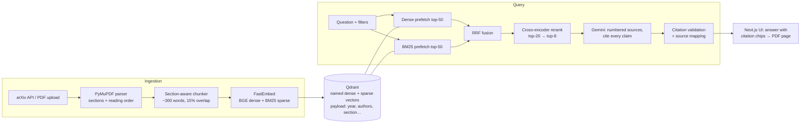

# ResearchRAG

ResearchRAG is a full-stack retrieval-augmented generation (RAG) platform for research papers. It covers semantic search and question answering across a paper library. Answers cite the exact paper section and page they come from. A built-in evaluation harness measures retrieval quality, answer quality and citation accuracy.

- **Ingestion:** arXiv import (by ID or topic search) or PDF upload. PDFs are parsed into sections using typography cues and two-column reading order, then chunked with section-aware boundaries.
- **Hybrid retrieval:**
  - dense BGE embeddings and sparse BM25, fused with reciprocal rank fusion (RRF) in Qdrant;
  - then a cross-encoder reranker;
  - with metadata filters on year, author, arXiv category, paper and section type.
- **Citation-aware generation:** Gemini answers only from numbered sources and cites every claim. Citation markers are checked against the retrieved sources and mapped back to the paper, section and page. The UI opens the PDF at the cited page.
- **Automated evaluation:**
  - synthetic question sets with gold passages;
  - IR metrics (Hit@k, Recall@k, MRR, nDCG) compared across four retrieval configs;
  - LLM-as-judge scoring of faithfulness, answer relevance and correctness;
  - per-claim citation precision and coverage.

## Architecture



| Layer | Tech |
|---|---|
| API | FastAPI, Pydantic v2, SQLModel/SQLite (paper metadata and eval runs), SSE streaming |
| Retrieval | Qdrant (server or embedded), FastEmbed: `BAAI/bge-small-en-v1.5` (dense), `Qdrant/bm25` (sparse, IDF), `Xenova/ms-marco-MiniLM-L-6-v2` (cross-encoder). All ONNX, CPU-only, no torch. |
| Generation | Google Gemini (`google-genai`), client-side rate limiting and retry for the free tier |
| Frontend | Next.js 16 (App Router), React 19, Tailwind CSS 4, Recharts, react-markdown + KaTeX |

## Quick start

Prerequisites: Python ≥ 3.12 with [uv](https://docs.astral.sh/uv/), Node ≥ 20, and a free [Gemini API key](https://aistudio.google.com/apikey). Docker is optional.

```bash
# 1. Backend
cd backend
uv sync
cp .env.example .env          # then set GEMINI_API_KEY
uv run uvicorn app.main:app --port 8000

# 2. Frontend (new terminal)
cd frontend
npm install
cp .env.example .env.local    # NEXT_PUBLIC_API_URL=http://localhost:8000
npm run dev                   # http://localhost:3000
```

In the UI, go to **Library** and paste some arXiv IDs, for example `1706.03762 2005.11401 1810.04805 2004.04906`. Wait for them to show **Indexed**, then try **Search** and **Ask**.

Without a Gemini key, ingestion, search and retrieval evaluation still work. Chat, question generation and answer judging need the key.

### Vector store: embedded or server

By default `QDRANT_URL` is empty, and Qdrant runs **embedded** in the API process with data in `backend/data/qdrant_local`. That setup needs no Docker, but only one process can open the store at a time.

To use a Qdrant server instead:

```bash
docker compose up -d qdrant
# backend/.env
QDRANT_URL=http://localhost:6333
```

## Evaluation

The evaluation answers two questions:
1. Does each retrieval strategy find the right passage?
2. Are the generated answers faithful, relevant and correctly cited?

1. **Question set.** Gemini writes one self-contained question and a reference answer for each sampled chunk. Sampling is round-robin across papers, and front matter and appendices are skipped. The source chunk is the *gold* passage. Hand-written items with `"source": "manual"` can be appended to `backend/data/eval/dataset.jsonl`.
2. **Retrieval metrics.** These are computed locally for four configs:

   | Config | Description |
   |---|---|
   | `dense` | BGE only |
   | `sparse_bm25` | BM25 only |
   | `hybrid_rrf` | Dense + BM25, RRF |
   | `hybrid_rrf_rerank` | Hybrid, then cross-encoder |

   Reported per config: Hit@{1,3,5,10}, Recall@{5,10}, MRR, nDCG@10, P@5 and mean latency.
3. **Generation and citation metrics.** These use one judge call per answer to stay inside free-tier quotas:

   | Metric | Meaning |
   |---|---|
   | faithfulness | Every claim is supported by the retrieved sources |
   | answer_relevance | The answer addresses the question |
   | context_relevance | The retrieved sources are on-topic |
   | correctness | The answer agrees with the reference answer |
   | citation_precision | Share of (sentence, cited source) pairs where that source actually supports the sentence |
   | citation_coverage | Share of answer sentences that carry a citation |
   | gold_cited | Whether the answer cites the gold passage, when that passage was retrieved |

   Judge scores are 1–5, rescaled to 0–1.

Run the evaluation from the **Evaluation** page, or from the CLI. In embedded mode, stop the API first.

```bash
cd backend
uv run python scripts/eval_cli.py generate --n 40
uv run python scripts/eval_cli.py run                                  # retrieval, all configs
uv run python scripts/eval_cli.py run --gen hybrid_rrf_rerank --max-gen 20 --out results.json
```

### Results

Retrieval on the four example papers (Transformer, BERT, DPR, RAG; 153 chunks), scored on 28 hand-written questions, 7 per paper. Each question was written from one passage read directly from the chunked PDFs, not picked through search, so the gold labels don't favor any retriever. Latency is the mean per query on a 4-core CPU.

| Config | Hit@1 | Hit@5 | MRR | nDCG@10 | Latency |
|---|---|---|---|---|---|
| Dense | 0.786 | 0.929 | 0.830 | 0.854 | 102 ms |
| BM25 | 0.643 | 0.964 | 0.765 | 0.815 | 18 ms |
| Hybrid (RRF) | **0.786** | **0.964** | **0.851** | **0.879** | 91 ms |
| Hybrid + rerank | 0.714 | 0.964 | 0.808 | 0.847 | 5.3 s |

- Hybrid RRF has the highest MRR and nDCG. It keeps dense retrieval's precision at rank 1 and BM25's recall at rank 5.
- The `ms-marco-MiniLM-L-6-v2` cross-encoder doesn't help here. Six gold passages slip from #1–4 to one place lower, and two move up. The passages it promotes share the question's key terms but don't contain the answer, for example an appendix that names "Thorough Decoding" without defining it. This small web-search model isn't tuned for scientific text, and a larger reranker such as `BAAI/bge-reranker-base` may do better.
- With 28 questions, one question moves MRR by up to 0.036, so treat differences under about 0.05 as noise.

The question set is in `backend/app/evaluation/manual_questions.jsonl`. To reproduce the table, copy it to `backend/data/eval/dataset.jsonl` and run the retrieval evaluation. Chunk IDs are deterministic, so the gold labels match as long as the same PDF versions are indexed. Answer-quality metrics need a Gemini key and are not reported yet.

**Caveats.**
- Synthetic questions are written from a single chunk, so they tend to reuse its vocabulary, which favors lexical retrieval. The prompt asks for paraphrased, self-contained questions to reduce this.
- Only one gold chunk is labeled per question. Neighboring chunks that also answer it count as misses, which makes the retrieval numbers conservative.
- The judge is the same model family as the generator. Treat absolute judge scores as relative comparisons.

## Design notes

- **PDF parsing.**
  - Headings are detected from bold weight and font size relative to body text, plus numbering patterns. Numbers set as separate spans ("3" + "Model Architecture") are rejoined.
  - Blocks are ordered column by column, so two-column papers don't interleave.
  - Running headers and footers, the vertical arXiv sidebar and the reference list are dropped.
  - Text is NFKC-normalized so ligatures like "fi" match keyword search.
- **Chunking.** Chunks are packed at sentence level (~400 tokens), never cross a section boundary, carry page ranges for citations, and overlap by 15%. Each chunk is embedded with its paper title and section heading as a prefix.
- **Hybrid search.** Both prefetches apply the same payload filter, so filtering happens before fusion rather than after. RRF avoids calibrating dense and sparse scores against each other.
- **Reranking cost.** Cross-encoder cost grows linearly with candidates (~0.15 s each on a 4-core CPU), so only the top `RERANK_CANDIDATES` fused results (default 20) are reranked.
- **Citations.** The model sees sources as `[n] Title — §Section, p. X`. After generation, out-of-range markers are stripped and the rest are resolved to chunk, paper, section and page.
- **Free-tier friendly.** A client-side limiter spaces Gemini calls to `GEMINI_RPM`, and 429 and 5xx responses are retried with exponential backoff.

## Project layout

```
backend/
  app/
    ingestion/    pdf_parser, chunker, arxiv_client, pipeline
    retrieval/    embeddings, vector_store, filters, hybrid, reranker
    generation/   llm (Gemini), prompts, citations, rag
    evaluation/   dataset, retrieval_metrics, generation_metrics, citation_metrics, runner
    api/          papers, search, chat (SSE), eval
  scripts/eval_cli.py
  tests/          parser/chunker, filters, metrics, citation parsing
frontend/
  app/            / (library), /search, /chat, /eval
  components/     FilterPanel, AnswerMarkdown (citation chips), Nav, ui
  lib/api.ts      typed API client and SSE reader
```

Run the tests with `cd backend && uv run pytest`.

## Troubleshooting

- **Python crashes on `import onnxruntime` (Windows).** Newer onnxruntime wheels segfault when the system MSVC runtime (`msvcp140.dll`) is older than 14.40. `pyproject.toml` pins `onnxruntime==1.19.2` for this reason. Installing the latest [VC++ Redistributable](https://learn.microsoft.com/cpp/windows/latest-supported-vc-redist) fixes the root cause, and also lets the native Qdrant Windows binary run.
- **`Storage folder ... is already accessed by another instance`.** Embedded Qdrant is single-process. Stop the API before running the CLI, or switch to server mode.
- **Gemini 429s.** Lower `GEMINI_RPM`, or evaluate fewer questions with `--max-gen`.
